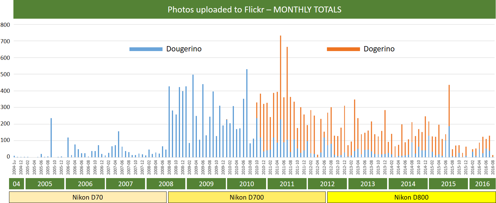

# photo-keywords

Tools for managing keywords associated with photographs.

For now, this is just the code used to harvest all of the tags from my Dougerino and Dogerino accounts on Flickr.

As described [here](http://mahugh.com/2013/04/02/my-backup-process/), I've been using Flickr to search my photos
for years. But now that I have all of my photo-description data local (including the Flickr tags as well as other
information from various sources), I'm going to merge it into a single consistent approach to tagging my photos.
Then I'll put together a simple search facility that I'll stand up where I can use it from any device.

## Flickr Tags

To retrieve all of the tags associated with my ~23,000 photos across two Flickr accounts, there were two steps:

1) Get photostream for each account from flickr.people.getPhotos.
2) Get tags for each photo from flick.photos.getInfo.

I used a page size of 100, to make it easy to manage batches of photo info calls to accommodate the 3600 call per hour API rate limit.

Summary of data retrieved:

| Category/Entity | Count |
| --- | --- |
| Dougerino photos  | 12,205  |
| Dogerino photos  | 10,713  |
| *TOTAL PHOTOS* | *22,918* |
| Dougerino tags | 35,742  |
| Dogerino tags | 27,206  |
| *TOTAL TAGS* | *62,948* |

