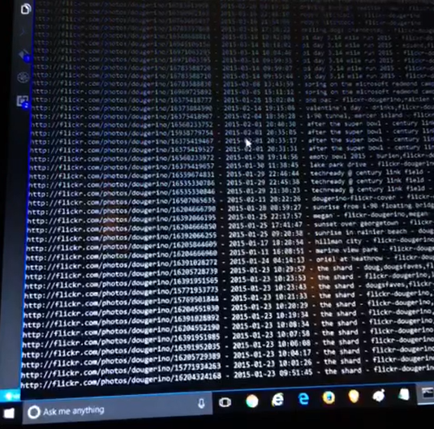

# photo-keywords

Tools for managing keywords associated with photographs.

For now, only includes [flickrtags.py](https://github.com/dmahugh/photo-keywords/blob/master/flickrtags.py), a program to harvest all photo tags from my Dougerino and Dogerino accounts on Flickr.

## Flickr Tags

First step was to get all of my Flickr tags local, where I can associate them with the original images in my backup stream. This requires
two sets of calls to the Flickr API: first we get photos for each account (method=flickr.people.getPhotos), then for each photo we get
the tags and timestamp (method=flick.photos.getInfo).

Flickr does *not* store the original filename, so we'll use the timestamp to figure out which is the original image in our backup stream.
(This assumes the timestamp has been unchanged by the round trip through Flick; we'll find out soon.)

Summary of data retrieved:

| Flickr account | Photos | Tags |
| --- | --- | --- |
| [Dougerino](http://flickr.com/photos/dougerino) | 12,205 | 35,742 |
| [Dogerino](http://flickr.com/photos/dogerino) | 10,713 | 27,206 |
| TOTAL | 22,918 | 62,948 |

The data in the chart above shows some key dates for me over the last 12 years:

* September 2004 - moved from analog to digital, with a Nikon D70
* October 2005 - moved to Seattle, took lots of pictures
* August 2008 - [started using Flickr](http://mahugh.com/2008/08/24/finallyeluctantly-flickr/)
* October 2010 - create a separate Dogerino account for dog photos after we got Alice
* May 2011 - massive [road trip](https://www.flickr.com/photos/dogerino/albums/72157626806442330) through 21 states
* April 2012 - laptop stolen, lost a month of photos before posting them
* July 2015 - road trip to the Senior Games
* August 2015 - started using [Instagram](https://www.instagram.com/dougerino/), stopped posting so much to Flickr

As described [here](http://mahugh.com/2013/04/02/my-backup-process/), I've been using Flickr to search my photos
for years. But now that I have all of my photo-description data local (including the Flickr tags as well as other
information from various sources), I'm going to merge it into a single consistent approach to tagging my photos.
Then I'll put together a simple search facility that I'll stand up where I can use it from any device.

Tag harvesting in action ...

